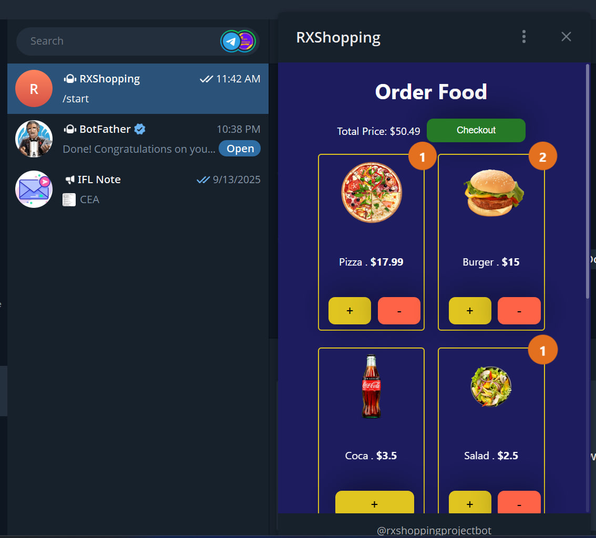

### Git Bash alternative

cat > README.md << 'EOF'
# RXShopping 🛒⚡ – Telegram Shop (React + Telegraf)

> A lightweight **Telegram mini-shop**: React WebApp UI inside Telegram + Node/Telegraf bot that opens the shop and handles checkout hooks.

## ✨ Features
- **WebApp inside Telegram** (opens via bot button)
- **Product cards + cart** (add/remove, live totals)
- **Clean component structure** (Button, Card, Cart)
- **Ready for payments**
- **Netlify deploy**

## 🌐 Deploy (Netlify)
\`\`\`bash
cd frontend
npm run build
\`\`\`
Drag & drop **/build** into Netlify. Put the site URL in \`bot.js\`.

## 🛠 Tech
React • Telegraf • Node.js • Netlify

## 📸 Screenshots
| Home | Cart |
|---|---|
 

## 🗺 Roadmap
- [ ] localStorage cart
- [ ] payments
- [ ] admin CRUD
- [ ] order notifications

## 📝 License
MIT © YOUR_NAME
EOF

## 👤 Author
**Rithy Ngy**  
📧 **Email:** rithyngycambo@gmail.com  
📱 **Phone:** (+855) 093 777 248      
📍 **Location:** Phnom Penh, Cambodia  
💬 **Telegram:** [@N_Rithy](https://t.me/N_Rithy)  
📞 **WhatsApp:** [Chat with me](https://wa.me/855093777248)
